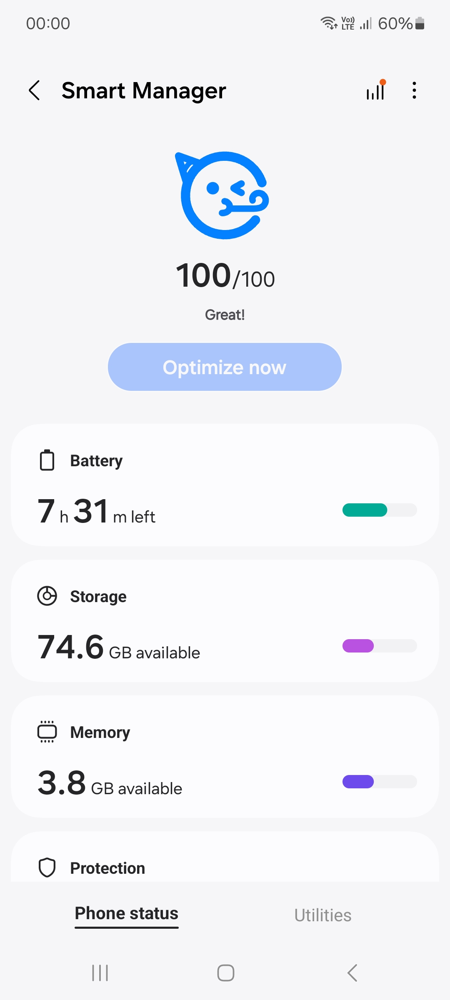
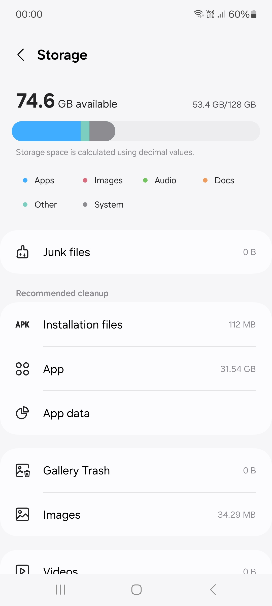
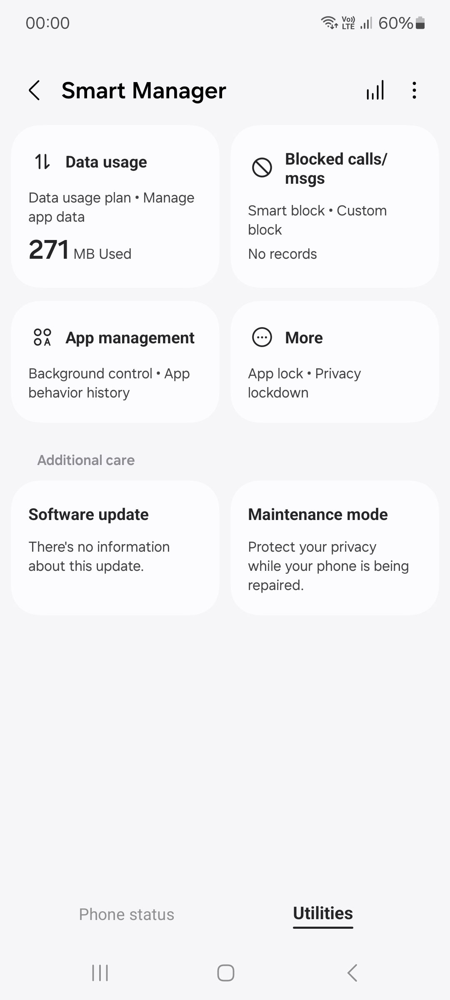

<h1 align="center">
  
</h1>

## SmartManagerCN Recovery Flashable ZIP
A simple recovery flashable ZIP to install the Chinese Smart Manager (SmartManagerCN) on your Samsung device with OneUI 6.1/6.1.1 and 7.x

SmartManagerCN is a replacement for Device Care on standard OneUI ROMs (except for China ROMs where SmartManagerCN is already pre-installed or added by the custom ROM maker).

Features not present in Device Care include:

- More advanced app management, applock, and auto-run apps
- Data usage tracking, plan addition, and app data usage tracking
- Advanced call and message blocking, and smart blocking
- Storage management with a cleaner UI

This flashable ZIP replaces Device Care with SmartManagerCN easily and requires little to no setup.

It includes the following apps:

- Smart Manager
- Smart Device Security
- AppLock
- Firewall

## Downloads
[Releases](https://github.com/saadelasfur/SmartManager/releases) and the [Galaxy Apks Telegram channel](https://t.me/galaxyapks) are the only sources for official downloads.

## Installation
Simply download the SmartManagerCN installer from the releases page and flash it with a custom recovery. If you still see Device Care installed after flashing the ZIP, follow this guide: [Uninstall Device Care](https://github.com/saadelasfur/SmartManager/blob/master/extras/uninstall_stock.md)

## Return to Device Care
Simply download the StockDeviceCare installer from the releases page and flash it with a custom recovery. If you still see Smart Manager installed after flashing the ZIP, follow this guide: [Uninstall Smart Manager](https://github.com/saadelasfur/SmartManager/blob/master/extras/uninstall_china.md)

## Screenshots

  
  
  

## Credits
- [@salvogiangri](https://github.com/salvogiangri) for his assistance and the base [action](https://github.com/Mesa-Labs-Archive/proprietary_vendor_samsung_a54x/blob/main/.github/workflows/check.yml) script.
- [BlassGO](https://xdaforums.com/m/blassgo.11402469/) for the awesome [Dynamic Installer](https://xdaforums.com/t/zip-dual-installer-dynamic-installer-stable-5-1-android-10-or-earlier.4279541/).
- [@jesec](https://github.com/jesec) and [@corsicanu](https://github.com/corsicanu) for the original GitHub Actions script.
- [@unix3dgforce](https://github.com/unix3dgforce) for his [lpunpack.py](https://github.com/unix3dgforce/lpunpack) script.
